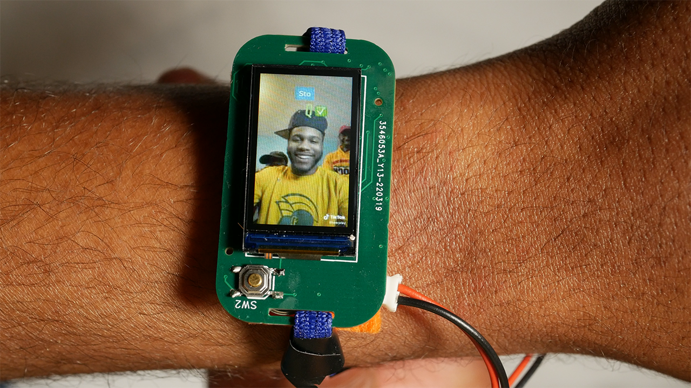
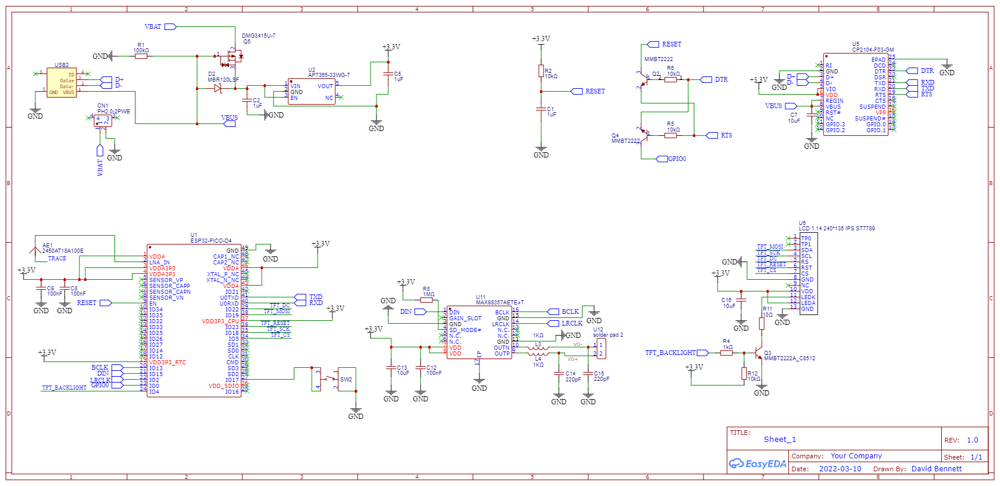

# Unofficial TikTok Watch

A proof of concept project for building a smartwatch that plays TikTok videos. Using an official API for Python, we can download TikTok videos then use OpenCV and PyDub to stream the data to the ESP32. On the ESP32 we play that data through an ST7789VW display and max98537a DAC.

You can check out the full youtube video here:

## Warning, this is messy 🥲

This is a proof of concept project with a timebox (so I have time to make the YouTube video that accompanies it). Therefore, there's lots of ugly code and scattered ideas throughout. Just a word of caution. 

## Schematics

## PCB

